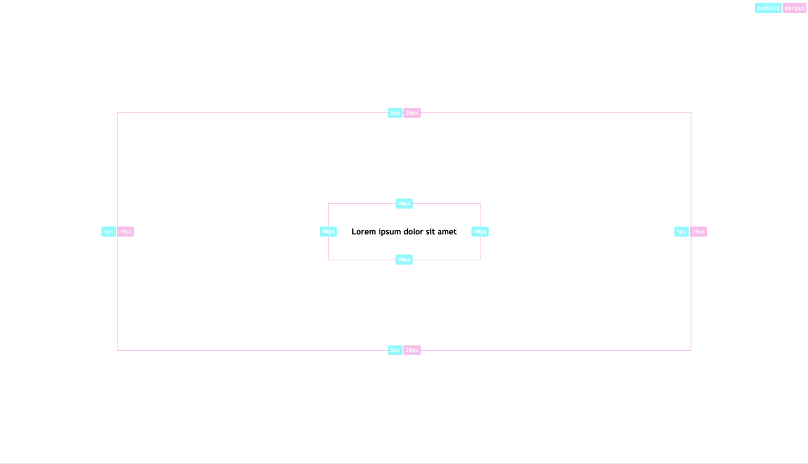

# Highlight element spaces

## What it does
A very simple debug script that you can embed in your website to display the margin and padding values for any kind of specified elements on your site. That's it.




## How to use it
1. Insert the script at the end of your website within the body tag `<script src="/path/to/script.js"></script>`
2. Add the `debug` class to your body opening tag.
3. Add the data-attribute `data-highlight-element-spaces=""` to your body tag an add the elements you like to debug in it (comma seperated) 

## Example
Have a look at the example folder for a full working example.
```html
    <body class="debug" data-highlight-element-spaces="article,.container">
        <main>
            <article></article
            <div class="container"></div>
        </main>
        <script src="/path/to/script.js"></script>
    </body>
```